<h1 align="center">Olá! Eu sou a Ana Letícia 👋</h1>

  👩‍💻 Desenvolvedora Web Jr I | Estudante de Ciência da Computação 

  

---

### 👩‍💻 Sobre mim

Sou estudante de Ciência da Computação e atuo como Desenvolvedora Web Jr I, com experiência no desenvolvimento de aplicações web em projetos profissionais, acadêmicos e pessoais.

Tenho experiência tanto em **back-end quanto em front-end**, trabalhando com diferentes tecnologias e stacks conforme as necessidades de cada projeto.

---

### 💻 Tecnologias e ferramentas

#### Back-end

  
  
  
  
  

#### Front-end

  
  
  
  
  
  
  
  
  

#### Banco de dados e ferramentas

  
  
  
  
  
  

---

### 📊 GitHub Stats

  
  

